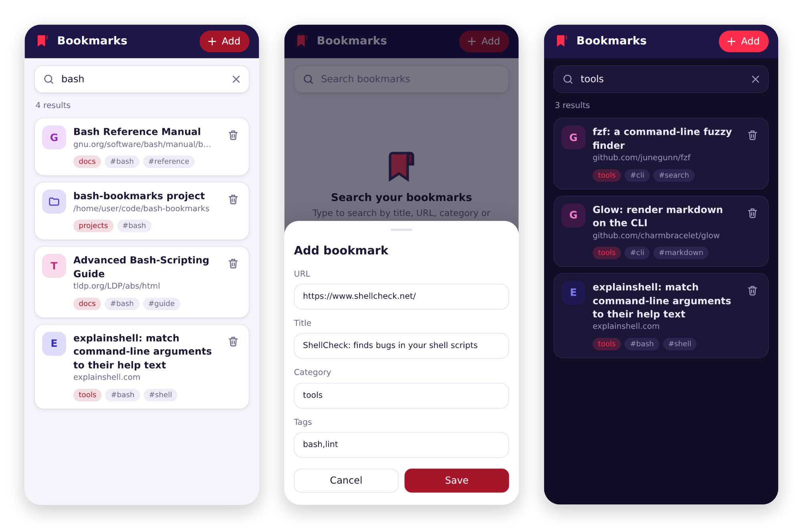

# Bash-Bookmarks

**Your bookmarks. Your server. In your pocket.**

A self-hosted bookmarks service that keeps every link as a plain markdown file you own, with a web app you can install on your phone and share links to straight from any app.

## TL;DR: up and running in 10 minutes

Run the server 24/7 in Docker on a Raspberry Pi or any homelab box, and reach it from anywhere over HTTPS with [Tailscale](https://tailscale.com). No port forwarding, no certificates to manage, and only your own devices can reach it.

**1. Start the server** on your Pi or homelab machine:

```bash
curl -fsSL https://get.docker.com | sh     # skip if Docker is already installed
sudo apt-get install -y git                # skip if git is already installed
git clone https://github.com/ArtBIT/portainer-bookmarks && cd portainer-bookmarks
echo "BOOKMARKS_HOME=$HOME/bookmarks" > .env
sudo docker compose up -d --build
```

**2. Give it an HTTPS address** on your private Tailscale network:

```bash
curl -fsSL https://tailscale.com/install.sh | sh
sudo tailscale up                          # prints a link to sign in
sudo tailscale serve --bg 9080
```

The first `tailscale serve` asks you to enable HTTPS for your tailnet, a single click in the Tailscale admin console. It then prints your address, something like `https://raspberrypi.your-tailnet.ts.net`.

**3. Install it on your phone:** install the Tailscale app and sign in with the same account, open that address in Chrome, then tap the menu and **Install app**. From now on, **Share** > **Bookmarks** saves any link, at home or on the go, as long as Tailscale is connected on the phone (Android can keep it always on).

Your bookmarks live in `~/bookmarks/data` on the server as plain markdown files. Already running Portainer and a reverse proxy? See [Deploying from this repository in Portainer](#deploying-from-this-repository-in-portainer) and [HTTPS with your own certificates](#https-with-your-own-certificates).



## Why self-host your bookmarks?

**Save anything in two taps.** Install the web app on your Android phone and "Bookmarks" shows up in the share sheet, right next to your messaging apps. Found a great article in Chrome, a video on YouTube, a thread on Reddit? Tap **Share**, tap **Bookmarks**, and the link and title are already filled in. Pick a category, hit Save, and get back to what you were doing.

**Your data is just files.** Every bookmark is a small markdown file in a folder named after its category. No database, no proprietary format, no lock-in. Back it up with rsync, version it with git, grep it from a terminal, or open the folder in Obsidian or any editor. If this project vanished tomorrow, your bookmarks would still be perfectly readable.

**No accounts, no ads, no telemetry.** Bookmark services come and go (goodbye, Pocket), and free ones tend to pay for themselves with your reading habits. This one runs on your own hardware and answers only to you.

**One library, every device.** The same server powers the phone app, the [bash-bookmarks](https://github.com/ArtBIT/bash-bookmarks) CLI and its Firefox add-on. Save a link on your phone during the commute, then pull it up from your terminal at your desk.

**Feels like a real app.** It launches full screen from your home screen, follows your phone's light or dark mode, and searches as you type across titles, URLs, categories and tags.

**Bring your history along.** Import browser bookmark exports (HTML), JSON, CSV or a Pocket export, and export everything back out whenever you like.

**Boring to run, in the best way.** A single small Python container that needs nothing beyond the standard library. Deploy it as a Portainer stack straight from this repository, put it behind Nginx Proxy Manager, and forget about it.

> Sharing from other apps works on Android (Chrome). On iPhone you can still add the web app to your home screen and add bookmarks from inside it.

## Features

- **Bookmark Management**: Add, search, and organize bookmarks
- **Web Interface**: Modern web UI for managing bookmarks
- **Import/Export**: Support for HTML, JSON, CSV, and Pocket exports
- **Docker Ready**: Full Docker containerization with Portainer support
- **API**: RESTful API for programmatic access
- **Search**: Full-text search across bookmarks
- **Categories & Tags**: Organize bookmarks with categories and tags

## Quick Start

### Using Docker (Recommended)

```bash
# Clone the repository
git clone <repository-url>
cd bookmarks

# Start the server
docker-compose up -d

# Access the web interface
open http://localhost:9080
```

### Using Portainer

1. **Upload to Portainer**:
   - In Portainer, go to "Stacks" → "Add stack"
   - Upload the `docker-compose.yml` file
   - Set environment variables if needed
   - Deploy the stack

2. **Environment Variables** (optional):
   ```bash
   PORT=9080                    # Server port
   DEBUG=INFO                   # Log level
   DOMAIN=bookmarks.yourdomain.com  # For Nginx Proxy Manager integration
   ```

3. **Access the Application**:
   - Web UI: `http://your-server:9080`
   - API: `http://your-server:9080/search?q=query`

### Deploying from this repository in Portainer

Portainer can build the stack straight from GitHub and redeploy when `main` changes:

1. **Stacks** > **Add stack** > **Repository**
2. Repository URL: `https://github.com/ArtBIT/portainer-bookmarks`, reference: `refs/heads/main`, compose path: `docker-compose.yml`
3. Bookmarks, logs and config are stored in host folders under `/portainer/Files/AppData/Config/bookmarks/`. To use a different location, add an environment variable such as `BOOKMARKS_HOME=/srv/bookmarks`.
4. Optionally enable **GitOps updates** so Portainer redeploys on new commits.

If a stack with the same `container_name` already runs, stop or remove it first; bind-mounted host folders are not touched.

## Web UI and Android app (PWA)


The server hosts a mobile friendly web UI at `http://your-server:9080/` for searching, adding and removing bookmarks, with links to the import and export pages.

The web UI can be installed as an app on Android, and then shows up in the native share sheet: share any link to "Bookmarks" and it opens the add form prefilled with the URL and title.

Android only installs PWAs served over HTTPS (or `localhost`), so put the server behind HTTPS first:

- **Nginx Proxy Manager:** add a proxy host with scheme `http`, forward host your server and port `9080`, and an SSL certificate the phone trusts. The server itself speaks plain HTTP, so the scheme must be `http`, not `https`.
- [Tailscale](https://tailscale.com/kb/1312/serve): `tailscale serve --bg 9080`, then open `https://<machine>.<tailnet>.ts.net` on the phone.
- Built in TLS: set `BOOKMARKS_TLS_CERT` and `BOOKMARKS_TLS_KEY` to a certificate and key the phone trusts.

Then open the URL in Chrome on Android, tap the menu and choose "Install app" (or "Add to Home screen").

The web UI has no authentication, so do not expose it to the public internet.

### HTTPS with your own certificates

Browsers only install a web app from a page served over HTTPS **without certificate warnings**. Clicking through "Your connection is not private" is not enough: the page stays marked "Not secure", the app's service worker is not registered, and "Install app" never appears. So every device that installs the app has to trust the certificate.

#### Easiest: skip custom certificates

- **Tailscale:** `tailscale serve --bg 9080` gives you a trusted `https://<machine>.<tailnet>.ts.net` address. Nothing to install on devices besides Tailscale.
- **A real domain:** if you own a domain, request a Let's Encrypt certificate in Nginx Proxy Manager with a **DNS challenge** for a name like `bookmarks.example.com`, and point that name at your server in your local DNS. The certificate is trusted everywhere, even though the server is only reachable at home.

#### Your own certificate authority (for names like `bookmarks.home`)

Names like `.home` or `.lan` cannot get public certificates. Instead of a single self-signed certificate, create a small certificate authority (CA) of your own once, install it on each device once, and then issue certificates for any number of home services.

**1. Create the CA** (once):

```bash
openssl req -x509 -new -nodes -newkey rsa:4096 -sha256 -days 3650 \
  -keyout home-root-ca.key -out home-root-ca.crt -subj "/CN=Home Root CA" \
  -addext "basicConstraints=critical,CA:TRUE" \
  -addext "keyUsage=critical,keyCertSign,cRLSign" \
  -addext "nameConstraints=critical,permitted;DNS:home"
```

The `nameConstraints` line limits this CA to names ending in `.home`, so even if its key leaked it could not be used to impersonate your bank. Change `home` to your local suffix (for example `lan`), or list several: `permitted;DNS:home,permitted;DNS:lan`. Keep `home-root-ca.key` private and never copy it to other devices.

**2. Issue a certificate for the server:**

```bash
openssl req -new -newkey rsa:2048 -nodes -subj "/CN=bookmarks.home" \
  -keyout bookmarks.home.key -out bookmarks.home.csr
openssl x509 -req -in bookmarks.home.csr -CA home-root-ca.crt -CAkey home-root-ca.key \
  -CAcreateserial -days 825 -sha256 -out bookmarks.home.crt \
  -extfile <(printf "subjectAltName=DNS:bookmarks.home\nextendedKeyUsage=serverAuth")
```

- Browsers only look at `subjectAltName`, not the `CN`. The exact name you type in the browser must be listed there.
- One certificate can cover several services: `subjectAltName=DNS:bookmarks.home,DNS:wiki.home`. List each name explicitly: browsers may reject a wildcard directly under the top-level name, such as `*.home`.
- Keep the validity at 825 days or less: Apple devices reject server certificates valid for longer.

**3. Use it in Nginx Proxy Manager:** **SSL Certificates** > **Add SSL Certificate** > **Custom**, upload `bookmarks.home.key` as the key and `bookmarks.home.crt` as the certificate. On the proxy host's **SSL** tab select it and enable **Force SSL**. The **Scheme** on the **Details** tab stays `http`.

**4. Make the name resolve** on your network, for example with a local DNS record in Pi-hole (**Local DNS** > **DNS Records**) or your router. On Android, **Settings** > **Network & internet** > **Private DNS** must be **Off** or **Automatic**, otherwise the phone skips your local DNS.

**5. Install the CA on each device.** Copy only `home-root-ca.crt` (never the `.key`):

- **Android:** **Settings** > **Security & privacy** > **More security settings** > **Encryption & credentials** > **Install a certificate** > **CA certificate**, then pick the file. Menu names vary by manufacturer; searching Settings for "CA certificate" finds it. The phone needs a screen lock. A "Network may be monitored" notice afterwards is expected.
- **iPhone / iPad:** send the file with AirDrop or email and open it, then **Settings** > **Profile Downloaded** > **Install**. Finally enable it under **Settings** > **General** > **About** > **Certificate Trust Settings**.
- **Windows:** double-click the file > **Install Certificate** > **Place all certificates in the following store** > **Trusted Root Certification Authorities**.
- **macOS:** open the file in Keychain Access, add it to the **System** keychain, open it and set **When using this certificate** to **Always Trust**.
- **Linux:** `sudo cp home-root-ca.crt /usr/local/share/ca-certificates/ && sudo update-ca-certificates`. Chrome and Firefox keep their own lists: import it in Chrome under **Settings** > **Privacy and security** > **Security** > **Manage certificates**, and in Firefox under **Settings** > **Privacy & Security** > **View Certificates** > **Authorities** > **Import** (tick "Trust this CA to identify websites").

**6. Install the app:** open `https://bookmarks.home` in Chrome on the phone. With a padlock and no warning, open the menu and choose **Install app** (or **Add to Home screen**).

#### Troubleshooting

| What you see | Cause |
|---|---|
| `NET::ERR_CERT_AUTHORITY_INVALID` | The CA is not installed on this device, or was installed as a user or VPN certificate instead of a **CA certificate**. |
| `NET::ERR_CERT_COMMON_NAME_INVALID` | The name in the address bar is missing from the certificate's `subjectAltName`. |
| `502 Bad Gateway` | The proxy host's **Scheme** is `https`; set it to `http`. |
| `ERR_NAME_NOT_RESOLVED` | The name does not resolve: check the local DNS record and Android's **Private DNS** setting. |
| Page works but no **Install app** | There is still a certificate warning somewhere, or the page was opened over `http://`. In desktop Chrome, **DevTools** > **Application** > **Manifest** lists what blocks installing. |

To see which names a running server's certificate covers:

```bash
echo | openssl s_client -connect bookmarks.home:443 -servername bookmarks.home 2>/dev/null \
  | openssl x509 -noout -subject -issuer -ext subjectAltName
```

## Docker Compose Variants

### Basic Setup
```bash
docker-compose up -d
```

### Production Setup
```bash
docker-compose -f docker-compose.yml -f docker-compose.prod.yml up -d
```

### With Nginx Proxy Manager
```bash
docker-compose -f docker-compose.yml -f docker-compose.nginx-proxy.yml up -d
```

### With Custom Volume Names
```bash
# Set environment variables for custom volume names
BOOKMARKS_DATA_VOLUME=my_data \
BOOKMARKS_LOGS_VOLUME=my_logs \
BOOKMARKS_CONFIG_VOLUME=my_config \
docker-compose -f docker-compose.yml -f docker-compose.custom-volumes.yml up -d
```

### With External Volumes
```bash
# Pre-create volumes
docker volume create my_bookmarks_data
docker volume create my_bookmarks_logs
docker volume create my_bookmarks_config

# Deploy with external volumes
BOOKMARKS_DATA_VOLUME=my_bookmarks_data \
BOOKMARKS_LOGS_VOLUME=my_bookmarks_logs \
BOOKMARKS_CONFIG_VOLUME=my_bookmarks_config \
docker-compose -f docker-compose.yml -f docker-compose.external-volumes.yml up -d
```

### Development Setup
```bash
cp docker-compose.override.yml.example docker-compose.override.yml
docker-compose up -d
```

## Data Management

### Host folders
`docker-compose.yml` bind-mounts host folders for data persistence, under `BOOKMARKS_HOME` (default `/portainer/Files/AppData/Config/bookmarks`):

- **`/portainer/Files/AppData/Config/bookmarks/data`**: Bookmarks storage (`/data/bookmarks`)
- **`/portainer/Files/AppData/Config/bookmarks/logs`**: Server logs (`/data/logs`)
- **`/portainer/Files/AppData/Config/bookmarks/config`**: Configuration files (`/app/config`)

The options below describe setups with Docker volumes instead.

### Volume Configuration Options

#### **1. Default Volumes (Recommended)**
```bash
# Uses default volume names: bookmarks_data, bookmarks_logs, bookmarks_config
docker-compose up -d
```

#### **2. Custom Volume Names**
```bash
# Use the custom volumes override file
BOOKMARKS_DATA_VOLUME=my_data \
BOOKMARKS_LOGS_VOLUME=my_logs \
BOOKMARKS_CONFIG_VOLUME=my_config \
docker-compose -f docker-compose.yml -f docker-compose.custom-volumes.yml up -d
```

#### **3. Stack Name-Based Volumes**
```bash
# Use template for stack name-based volumes
cp docker-compose.template.yml docker-compose.yml
# Edit docker-compose.yml and set STACK_NAME=your-stack-name
docker-compose up -d
```

#### **4. External Volumes**
```bash
# Pre-create volumes
docker volume create my_bookmarks_data
docker volume create my_bookmarks_logs
docker volume create my_bookmarks_config

# Deploy with external volumes
BOOKMARKS_DATA_VOLUME=my_bookmarks_data \
BOOKMARKS_LOGS_VOLUME=my_bookmarks_logs \
BOOKMARKS_CONFIG_VOLUME=my_bookmarks_config \
docker-compose -f docker-compose.yml -f docker-compose.external-volumes.yml up -d
```

### Setting Up Configuration (After Deployment)

After deploying in Portainer, set up your configuration:

```bash
# Run the setup script (replace 'bookmarks' with your stack name)
./setup-volumes.sh bookmarks

# Or manually create configuration
docker run --rm -v bookmarks_bookmarks_config:/config alpine sh -c \
  'echo "BOOKMARKS_DIR=/data/bookmarks" > /config/.bookmarks.env'
```

### Managing Data

**View bookmarks data:**
```bash
docker run --rm -v bookmarks_bookmarks_data:/data alpine ls -la /data
```

**View logs:**
```bash
docker run --rm -v bookmarks_bookmarks_logs:/data alpine ls -la /data
```

**Edit configuration:**
```bash
docker run --rm -v bookmarks_bookmarks_config:/config -it alpine sh -c \
  'apk add --no-cache nano && nano /config/.bookmarks.env'
```

## API Usage

### Search Bookmarks
```bash
# Search by query
curl "http://localhost:9080/search?q=python&format=json"

# Search with different formats
curl "http://localhost:9080/search?q=python&format=html"
curl "http://localhost:9080/search?q=python&format=text"
```

### Add Bookmark
```bash
curl -X POST "http://localhost:9080/add" \
  --data-urlencode "url=https://example.com/?a=1&b=2" \
  --data-urlencode "title=Example" \
  --data-urlencode "category=test" \
  --data-urlencode "tags=example"
```

Parameters are URL-decoded, so values containing `&`, `+` or spaces must be encoded (`--data-urlencode` does that).

### Web UI API

The web UI uses these JSON endpoints:

- `GET /api/search?q=searchterm`
- `POST /api/add` with a JSON body `{url, title, category, tags}`
- `DELETE /api/remove` with a JSON body `{id}`

### Import Bookmarks
```bash
# Use the web interface at http://localhost:9080/import
# Or upload files via the web form
```

## File Structure

```
bookmarks/
├── docker-compose.yml                    # Main compose file (fixed volumes)
├── docker-compose.prod.yml              # Production overrides
├── docker-compose.nginx-proxy.yml       # Nginx Proxy Manager integration
├── docker-compose.custom-volumes.yml    # Custom volume names
├── docker-compose.external-volumes.yml  # External volumes configuration
├── docker-compose.template.yml          # Template for stack name-based volumes
├── docker-compose.override.yml          # Development overrides
├── env.example                          # Environment variables template
├── setup-volumes.sh                     # Volume setup script
├── docker/                              # Docker build context
│   ├── Dockerfile                       # Container definition
│   ├── bookmarks-server.py              # Python HTTP server
│   ├── bookmarks_manager.py             # Bookmark management logic
│   ├── bookmarks_importer.py            # Import functionality
│   ├── config.py                        # Configuration
│   ├── static/                          # Web assets
│   ├── data/                            # Bookmarks data (not in container)
│   └── logs/                            # Server logs (not in container)
├── NGINX_PROXY_GUIDE.md                # Nginx Proxy Manager guide
└── README.md                            # This file
```

## Configuration

### Environment Variables

| Variable | Default | Description |
|----------|---------|-------------|
| `PORT` | `9080` | Server port |
| `DEBUG` | `INFO` | Log level |
| `BOOKMARKS_DIR` | `/data/bookmarks` | Bookmarks data directory |
| `LOG_FILE` | `/data/logs/bookmarks-server.log` | Log file path |
| `BOOKMARKS_DATA_VOLUME` | `bookmarks_data` | Data volume name (with custom-volumes.yml) |
| `BOOKMARKS_LOGS_VOLUME` | `bookmarks_logs` | Logs volume name (with custom-volumes.yml) |
| `BOOKMARKS_CONFIG_VOLUME` | `bookmarks_config` | Config volume name (with custom-volumes.yml) |

### Port Configuration

Change the server port:

```bash
# Using environment variable
PORT=9090 docker-compose up -d

# Using the set-port script
cd docker
./set-port.sh 9090
```

## Development

### Local Development
```bash
# Clone and setup
git clone <repository-url>
cd bookmarks

# Start development environment
cp docker-compose.override.yml.example docker-compose.override.yml
docker-compose up -d

# View logs
docker-compose logs -f bookmarks-server
```

### Building from Source
```bash
cd docker
docker build -t bookmarks-server .
docker run -p 9080:9080 bookmarks-server
```

## Troubleshooting

### Port Conflicts
```bash
# Check if port is in use
netstat -tlnp | grep :9080

# Change port
PORT=9090 docker-compose up -d
```

### Permission Issues
```bash
# Fix data directory permissions
sudo chown -R 1000:1000 docker/data docker/logs
```

### Health Check Failures
```bash
# Check container logs
docker-compose logs bookmarks-server

# Restart container
docker-compose restart bookmarks-server
```

### Volume Issues
```bash
# Check volume status
docker volume ls | grep bookmarks

# Inspect volume contents
docker run --rm -v bookmarks_bookmarks_data:/data alpine ls -la /data

# Create missing volumes
docker volume create bookmarks_bookmarks_data
docker volume create bookmarks_bookmarks_logs
docker volume create bookmarks_bookmarks_config
```

## Contributing

1. Fork the repository
2. Create a feature branch
3. Make your changes
4. Test with Docker
5. Submit a pull request

## License

This project is licensed under the MIT License - see the LICENSE file for details.
